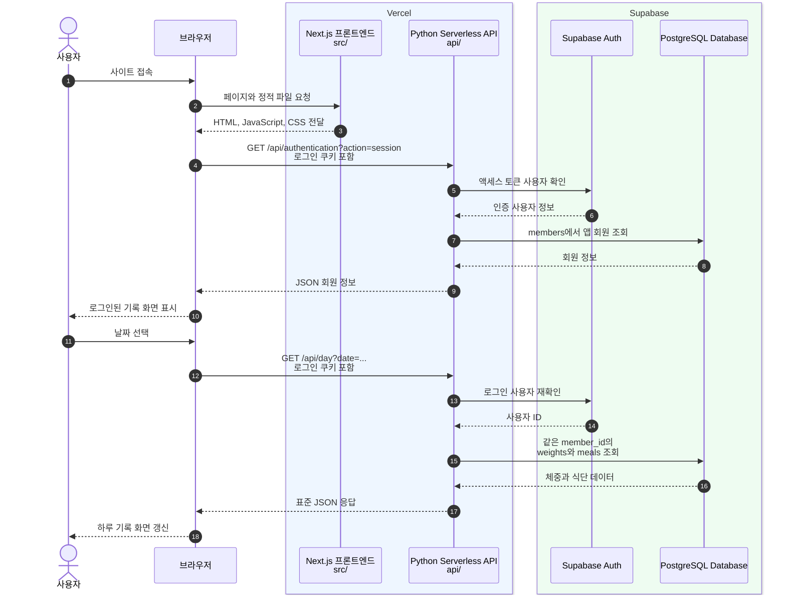
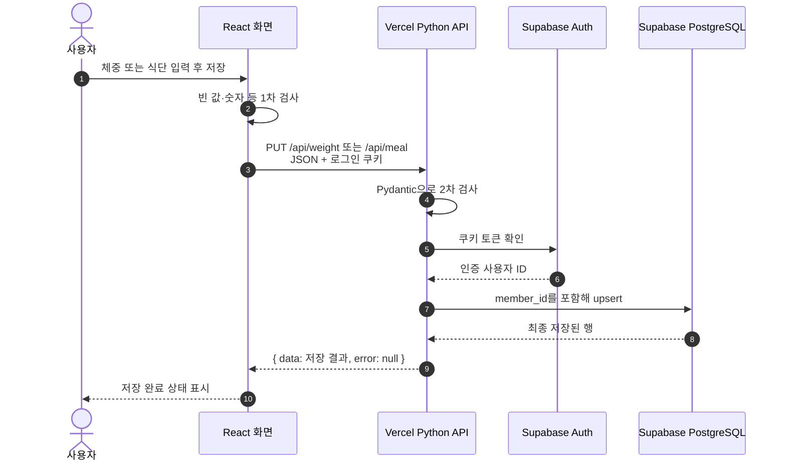

# 사용자 요청으로 이해하는 프론트엔드·백엔드·Supabase 흐름

이 문서는 웹 개발을 처음 배우는 학생이 **「오늘도 가볍게」 프로젝트에서 버튼을 한 번 눌렀을 때 어떤 일이 일어나는지** 이해할 수 있도록 설명합니다.

코드를 처음부터 모두 읽으려고 하기보다, 아래 한 문장을 먼저 기억하면 좋습니다.

> 사용자가 화면에서 행동하면 프론트엔드가 요청을 만들고, 백엔드가 요청을 검사한 뒤 Supabase에서 데이터를 읽거나 저장하고, 그 결과를 다시 화면에 보여 줍니다.

---

## 1. 세 부분의 역할

식당에 비유하면 각 부분을 쉽게 구분할 수 있습니다.

| 프로젝트의 부분 | 식당 비유                      | 이 프로젝트에서 하는 일                                              |
| --------------- | ------------------------------ | -------------------------------------------------------------------- |
| 프론트엔드      | 손님이 보는 메뉴판과 주문 화면 | 날짜·체중·식단 입력 화면을 보여 주고 사용자의 클릭과 입력을 받음     |
| 백엔드          | 주문을 확인하는 직원           | 로그인 여부와 입력값을 검사하고 Supabase에 조회·저장 명령을 보냄     |
| Supabase        | 재료 창고와 회원 명부          | 회원, 체중, 식단 데이터를 PostgreSQL에 보관하고 이메일 인증을 처리함 |

전체 흐름은 다음과 같습니다.

```text
사용자
  ↓ 클릭 또는 입력
Next.js + React 프론트엔드 (src/)
  ↓ HTTP 요청: 주소, 메서드, JSON, 로그인 쿠키
Python 백엔드 API (api/)
  ↓ 인증 확인, 입력 검증, 데이터베이스 명령
Supabase Auth + PostgreSQL
  ↓ 조회 또는 저장 결과
Python 백엔드 API
  ↓ 정해진 JSON 응답
Next.js + React 프론트엔드
  ↓ 상태를 바꾸고 화면을 다시 그림
사용자
```

중요한 점은 **브라우저가 Supabase 데이터베이스를 직접 호출하지 않는다**는 것입니다. 모든 주요 데이터 요청은 Python 백엔드를 통과합니다. 따라서 `SUPABASE_SERVICE_ROLE_KEY` 같은 강한 권한의 비밀 키가 브라우저에 노출되지 않습니다.

### 1.1 현재 인프라 구조 시퀀스 다이어그램

아래 그림은 현재 프로젝트가 배포되었을 때 사용자의 요청이 실제 인프라 사이를 이동하는 순서입니다.



그림에서 같은 색 상자는 같은 외부 서비스 안에서 실행된다는 뜻입니다.

- **Vercel**은 Next.js 화면을 배포하고 `api/`의 Python 코드를 요청마다 서버리스 함수로 실행합니다.
- **Supabase**는 로그인과 토큰을 담당하는 Auth, 데이터를 보관하는 PostgreSQL을 제공합니다.
- **브라우저**에는 화면 코드만 내려오며 Supabase의 `service_role` 키는 내려오지 않습니다.
- 브라우저와 백엔드는 HTTPS와 JSON으로 통신하고, 백엔드와 Supabase는 서버 전용 환경 변수로 연결됩니다.
- Python 서버리스 함수는 요청이 올 때 실행되므로, 영구 데이터는 함수 메모리가 아니라 Supabase에 저장해야 합니다.

저장 요청도 기본 구조는 같습니다. 달라지는 부분은 마지막 데이터베이스 작업이 `조회(select)`가 아니라 `추가 또는 수정(upsert)`이라는 점입니다.



---

## 2. 프로젝트 폴더를 지도처럼 보기

```text
diet/
├─ src/
│  ├─ app/                    # 사용자가 보는 페이지
│  │  ├─ page.tsx            # 날짜별 체중·식단 기록 화면
│  │  └─ calendar/page.tsx   # 달력 페이지
│  ├─ components/            # 여러 화면에서 사용하는 UI 조각
│  │  ├─ AuthGate.tsx        # 로그인·회원가입·이메일 인증 화면
│  │  ├─ MealCard.tsx        # 한 끼 입력 카드
│  │  └─ CalendarView.tsx    # 월간 달력과 날짜 상세 화면
│  ├─ services/
│  │  ├─ apiClient.ts        # 백엔드에 요청을 보내는 공통 함수
│  │  └─ localDayStorage.ts  # 개발용 로컬 저장소 대체 기능
│  └─ types/                 # 프론트엔드가 기대하는 데이터 모양
├─ api/
│  ├─ authentication.py      # 회원가입·인증·로그인·로그아웃
│  ├─ day.py                 # 하루 전체 기록 조회·삭제
│  ├─ meal.py                # 식단 저장·삭제
│  ├─ weight.py              # 체중 저장
│  ├─ calendar.py            # 한 달 요약 조회
│  ├─ lib/                   # 인증, 응답, 검증, Supabase 연결 공통 코드
│  └─ models/                # Pydantic 요청·응답 모델
└─ supabase/migrations/      # 데이터베이스 구조를 순서대로 변경하는 SQL
```

파일을 찾을 때는 먼저 “화면 문제인가, API 문제인가, 데이터 구조 문제인가?”를 생각하면 됩니다.

- 화면과 클릭 동작: `src/`
- 요청 검증과 데이터 처리: `api/`
- 테이블·제약 조건·DB 함수: `supabase/migrations/`

---

## 3. HTTP 요청에서 꼭 알아야 할 네 가지

프론트엔드와 백엔드는 HTTP로 대화합니다. 이 프로젝트에서는 다음 네 가지를 보면 요청을 이해할 수 있습니다.

1. **주소(URL)**: 어떤 기능에 요청하는지 나타냅니다. 예: `/api/weight`
2. **메서드**: 무엇을 할지 나타냅니다.
   - `GET`: 조회
   - `POST`: 새로운 동작 실행(로그인, 회원가입 등)
   - `PUT`: 저장하거나 기존 값 갱신
   - `DELETE`: 삭제
3. **요청 본문(body)**: 서버에 보낼 실제 데이터입니다. 보통 JSON입니다.
4. **쿠키(cookie)**: 로그인한 사용자인지 증명하는 토큰이 담깁니다.

예를 들어 체중 저장 요청은 다음과 같습니다.

```http
PUT /api/weight
Content-Type: application/json
Cookie: diet_access_token=...

{
  "date": "2026-08-13",
  "weight": 65.4
}
```

`src/services/apiClient.ts`의 `fetchApi()`가 모든 요청에 `credentials: "same-origin"`을 사용하므로, 같은 사이트의 로그인 쿠키가 자동으로 함께 전송됩니다. JavaScript 코드가 토큰 값을 직접 읽어서 붙이지 않아도 됩니다.

---

## 4. 공통 응답 모양

백엔드는 성공과 실패를 같은 틀(envelope)에 넣어 반환합니다.

성공 예시:

```json
{
  "data": {
    "date": "2026-08-13",
    "weight": 65.4
  },
  "error": null
}
```

실패 예시:

```json
{
  "data": null,
  "error": {
    "code": "VALIDATION_ERROR",
    "message": "입력값을 확인해 주세요."
  }
}
```

프론트엔드의 `fetchApi()`는 다음 순서로 응답을 확인합니다.

1. 응답을 JSON으로 읽습니다.
2. `data`와 `error`가 모두 있는지 확인합니다.
3. HTTP 상태가 실패이거나 `error`가 있으면 `ApiClientError`를 발생시킵니다.
4. 성공이면 `data`만 호출한 화면 코드에 돌려줍니다.

그래서 각 화면은 매번 JSON 틀을 직접 검사하지 않고 성공 데이터 또는 오류만 처리할 수 있습니다.

---

## 5. 로그인 상태 확인 흐름

모든 페이지는 `src/app/layout.tsx` 안의 `AuthGate`로 감싸져 있습니다. 따라서 기록 화면을 보여 주기 전에 로그인 상태부터 확인합니다.

```text
페이지 접속
  ↓
AuthGate가 GET /api/authentication?action=session 요청
  ↓
백엔드가 diet_access_token 쿠키 확인
  ↓
Supabase Auth에 토큰 사용자 확인
  ↓
members 테이블에서 앱 회원 조회
  ├─ 성공 → 회원 이름과 기록 화면 표시
  └─ 실패 → 로그인 화면 표시
```

백엔드의 `require_member()`는 단순히 쿠키가 있는지만 보지 않습니다.

1. `diet_access_token` 쿠키를 찾습니다.
2. Supabase Auth의 `get_user(token)`으로 유효한 사용자인지 확인합니다.
3. 인증 사용자의 ID로 `members` 테이블을 조회합니다.
4. 둘 다 확인된 경우에만 `AuthenticatedMember`를 반환합니다.

액세스 토큰이 만료되었지만 `diet_refresh_token`이 남아 있으면 세션 API가 Supabase에 갱신을 요청하고 새 쿠키를 설정합니다. 두 쿠키는 `HttpOnly`이므로 브라우저 JavaScript가 값을 읽기 어렵게 보호됩니다.

---

## 6. 회원가입과 이메일 인증 흐름

회원가입은 한 번의 요청이 아니라 **가입 요청 → 이메일 확인 → 앱 회원 생성**의 세 단계입니다.

### 6.1 가입 요청

1. 사용자가 이름, 이메일, 비밀번호를 입력합니다.
2. `AuthGate.tsx`가 `POST /api/authentication?action=signup`을 호출합니다.
3. 백엔드는 Pydantic 모델로 입력 형식을 검사합니다.
4. Supabase Auth의 `sign_up()`이 인증 사용자를 만들고 인증 메일을 보냅니다.
5. 백엔드는 `reserve_member_signup` DB 함수를 호출해 이름과 이메일을 `member_signup_claims`에 임시 저장합니다.
6. 프론트엔드는 인증번호 입력 화면으로 바뀝니다.

비밀번호는 앱의 `members` 테이블에 저장하지 않습니다. 비밀번호 처리는 Supabase Auth가 담당합니다.

### 6.2 이메일 인증 완료

1. 사용자가 이메일로 받은 6자리 번호를 입력합니다.
2. 프론트엔드가 `POST /api/authentication?action=verify_email`을 호출합니다.
3. 백엔드가 Supabase Auth의 `verify_otp()`로 번호를 확인합니다.
4. `complete_verified_member_signup` DB 함수가 인증 완료 여부와 가입 대기 정보를 다시 확인합니다.
5. 확인되면 `members` 테이블에 앱 회원을 만듭니다.
6. 백엔드는 액세스·리프레시 토큰을 쿠키에 저장하고 회원 정보를 반환합니다.
7. 프론트엔드는 로그인된 기록 화면을 보여 줍니다.

`member_signup_claims`는 이메일 인증 전에 이름을 잠시 보관하는 대기실이고, `members`는 인증을 마친 실제 앱 회원 명부라고 생각하면 됩니다.

---

## 7. 하루 기록을 불러오는 흐름

사용자가 기록 페이지를 열거나 날짜를 바꾸면 `src/app/page.tsx`가 다음 요청을 보냅니다.

```http
GET /api/day?date=2026-08-13
```

처리 순서는 다음과 같습니다.

1. 프론트엔드가 선택한 날짜를 URL의 `date` 쿼리 값으로 보냅니다.
2. `api/day.py`가 날짜 형식이 올바른지 검사합니다.
3. `require_member()`가 로그인 사용자를 확인합니다.
4. Supabase의 `meals` 테이블에서 `member_id`와 날짜가 같은 식단을 조회합니다.
5. `weights` 테이블에서도 같은 회원·날짜의 체중을 조회합니다.
6. 백엔드는 비어 있는 끼니도 포함한 하루 데이터로 조립합니다.
7. 프론트엔드는 받은 데이터로 입력칸과 식단 카드를 다시 그립니다.

응답의 핵심 모양은 다음과 같습니다.

```json
{
  "date": "2026-08-13",
  "weight": { "date": "2026-08-13", "weight": 65.4 },
  "meals": {
    "breakfast": null,
    "lunch": {
      "id": "...",
      "date": "2026-08-13",
      "meal": "lunch",
      "food": "현미밥과 닭가슴살",
      "type": "clean"
    },
    "dinner": null,
    "snack": null
  }
}
```

기록이 전혀 없는 날도 `404`가 아니라 빈 하루 데이터를 `200`으로 반환합니다. 덕분에 프론트엔드는 “없는 날짜”와 “정상적으로 비어 있는 날짜”를 혼동하지 않습니다.

---

## 8. 체중을 저장하는 흐름

사용자가 체중을 입력하고 저장 버튼을 누르면 다음 일이 일어납니다.

1. `page.tsx`가 빈 값인지, 숫자인지, 0보다 큰지 먼저 확인합니다.
2. 통과하면 `PUT /api/weight`로 날짜와 체중을 보냅니다.
3. `api/weight.py`가 JSON 크기·형식과 Pydantic 모델을 다시 검사합니다.
4. 백엔드가 로그인 회원 ID를 얻습니다.
5. Supabase `weights` 테이블에 `upsert`합니다.
6. 저장된 행을 표준 성공 응답으로 반환합니다.
7. 프론트엔드는 입력칸을 잠그고 “체중이 저장되었습니다.”를 보여 줍니다.

여기서 `upsert`는 “없으면 추가(insert), 이미 있으면 수정(update)”이라는 뜻입니다. 데이터베이스의 `(member_id, date)` 유일 제약 조건 때문에 한 회원은 하루에 체중 기록 하나만 가집니다.

프론트엔드와 백엔드가 입력값을 모두 검사하는 이유도 중요합니다.

- 프론트엔드 검사: 사용자가 빠르게 안내를 받을 수 있음
- 백엔드 검사: 누군가 화면을 거치지 않고 API를 직접 호출해도 잘못된 데이터를 막음
- 데이터베이스 제약 조건: 애플리케이션 코드가 실수하더라도 마지막 단계에서 데이터 규칙을 지킴

---

## 9. 식단을 저장하는 흐름

식단 카드에서 음식과 식단 종류를 저장하면 다음 요청이 전송됩니다.

```http
PUT /api/meal
Content-Type: application/json

{
  "date": "2026-08-13",
  "meal": "lunch",
  "food": "현미밥과 닭가슴살",
  "type": "clean"
}
```

`meal`은 `breakfast`, `lunch`, `dinner`, `snack` 중 하나이고, `type`은 `clean` 또는 `free`입니다.

백엔드는 `meals` 테이블에 `(member_id, date, meal)`을 기준으로 `upsert`합니다. 따라서 같은 사용자의 같은 날짜·같은 끼니를 다시 저장하면 행이 계속 늘어나지 않고 기존 기록이 바뀝니다.

식단 전체 초기화 버튼은 다음 요청을 사용합니다.

```http
DELETE /api/meal?date=2026-08-13
```

백엔드는 로그인한 회원의 해당 날짜 식단만 삭제합니다. 날짜 조건만 사용하지 않고 반드시 `member_id`도 함께 조건으로 사용하므로 다른 회원의 기록은 삭제되지 않습니다.

---

## 10. 달력 조회와 날짜 전체 삭제 흐름

달력 페이지는 날짜별 전체 식단 내용을 모두 받지 않습니다. 화면에 필요한 **체중과 식단 상태 요약**만 받습니다.

```http
GET /api/calendar?year=2026&month=8
```

`api/calendar.py`는 해당 월의 시작일과 마지막 날을 계산하고, 로그인 회원의 체중과 식단 종류만 조회합니다. 그리고 날짜마다 다음 규칙으로 상태를 만듭니다.

- 하나라도 `free`가 있으면 `free`
- 기록된 식단이 모두 `clean`이면 `clean`
- 식단 기록이 없으면 `null`

달력에서 한 날짜의 상세 기록을 선택하면 다시 `/api/day?date=...`를 호출합니다. 상세 패널에서 날짜 전체 초기화를 누르면 아래 요청으로 체중과 모든 끼니를 함께 삭제합니다.

```http
DELETE /api/day?date=2026-08-13
```

한 달 요약과 하루 상세 API를 나눈 이유는 달력을 열 때 필요하지 않은 음식 설명까지 모두 내려받지 않기 위해서입니다.

---

## 11. Supabase 안의 데이터 구조

최종 마이그레이션을 모두 적용한 뒤 핵심 관계는 다음과 같습니다.

```text
Supabase Auth의 auth.users
          │ id
          ▼
      members
          │ id = member_id
          ├───────────────┐
          ▼               ▼
       weights          meals
  회원별 날짜·체중   회원별 날짜·끼니·음식·종류
```

| 테이블                 | 중요한 열                                         | 역할                                 |
| ---------------------- | ------------------------------------------------- | ------------------------------------ |
| `members`              | `id`, `email`, `display_name`                     | 인증 사용자를 앱 회원 정보와 연결    |
| `member_signup_claims` | `user_id`, `email`, `display_name`                | 이메일 인증 전 가입 정보를 임시 보관 |
| `weights`              | `member_id`, `date`, `weight`                     | 회원별 하루 체중 보관                |
| `meals`                | `id`, `member_id`, `date`, `meal`, `food`, `type` | 회원별 하루 네 끼 식단 보관          |

데이터베이스 규칙의 예시는 다음과 같습니다.

- 체중은 0보다 커야 합니다.
- 한 회원의 같은 날짜에는 체중 하나만 저장됩니다.
- 한 회원의 같은 날짜·같은 끼니에는 식단 하나만 저장됩니다.
- 끼니와 식단 종류는 정해진 값만 사용할 수 있습니다.
- 회원이 삭제되면 그 회원의 식단과 체중도 함께 삭제됩니다(`on delete cascade`).

마이그레이션 파일은 번호 순서대로 적용됩니다. 앞 파일만 보고 현재 구조라고 판단하면 안 됩니다. 예를 들어 처음에는 날짜만 식별자로 사용했지만, 인증 기능을 추가한 뒤 `member_id`까지 포함하도록 구조가 변경되었습니다.

---

## 12. 보안 흐름

이 프로젝트는 데이터에 도달하기 전에 여러 겹으로 확인합니다.

```text
프론트엔드 입력 검사
  ↓
백엔드 Pydantic 검증
  ↓
로그인 토큰과 members 확인
  ↓
모든 조회·변경에 member_id 조건 추가
  ↓
PostgreSQL 제약 조건
```

Supabase 테이블에는 RLS(Row Level Security)가 활성화되어 있고 브라우저용 `anon`, `authenticated` 역할의 직접 권한은 회수되어 있습니다. 현재 구조에서는 서버의 `service_role`만 테이블을 다룹니다.

`service_role`은 RLS를 우회할 수 있는 강한 권한입니다. 따라서 백엔드가 모든 쿼리에 올바른 `member_id` 조건을 붙이는 것이 매우 중요합니다. 이 키는 반드시 서버 환경 변수에만 두고, `NEXT_PUBLIC_` 이름을 붙이거나 프론트엔드 코드에 작성하면 안 됩니다.

필요한 서버 환경 변수는 다음 두 개입니다.

```text
SUPABASE_URL
SUPABASE_SERVICE_ROLE_KEY
```

오류가 발생했을 때 백엔드는 상세 예외를 사용자에게 그대로 보내지 않고 내부 로그에 기록한 뒤 일반적인 오류 응답을 보냅니다. 이는 데이터베이스 구조나 비밀 정보를 오류 메시지로 노출하지 않기 위함입니다.

---

## 13. 개발용 localStorage 대체 흐름

기록 화면에는 백엔드 API가 `404 Not Found`일 때 브라우저의 `localStorage`를 사용하는 대체 코드가 있습니다.

```text
API 요청
  ├─ 정상 성공 → Supabase 데이터를 사용
  ├─ 404 → localStorage 데이터를 사용
  └─ 그 밖의 오류 → 오류 메시지 또는 빈 상태 표시
```

이 기능은 Python API가 아직 연결되지 않은 프론트엔드 개발 환경에서도 화면을 시험하기 위한 안전망입니다. 하지만 다음 차이가 있습니다.

- `localStorage` 데이터는 해당 브라우저에만 있습니다.
- 다른 기기나 브라우저와 공유되지 않습니다.
- 브라우저 데이터를 지우면 사라질 수 있습니다.
- Supabase에 저장된 데이터가 아닙니다.

운영 환경에서는 인증이 필요한 API가 보통 `401`을 반환하며, 이를 `404` 대체 저장으로 처리하지 않습니다. 실제 데이터 저장의 기준은 Supabase입니다.

---

## 14. API 빠른 참고표

| 사용자의 행동    | 메서드와 주소                                  | 백엔드 파일             | Supabase 작업                  |
| ---------------- | ---------------------------------------------- | ----------------------- | ------------------------------ |
| 로그인 상태 확인 | `GET /api/authentication?action=session`       | `api/authentication.py` | Auth 사용자와 `members` 조회   |
| 회원가입 요청    | `POST /api/authentication?action=signup`       | `api/authentication.py` | Auth 가입, 가입 대기 정보 저장 |
| 이메일 인증      | `POST /api/authentication?action=verify_email` | `api/authentication.py` | OTP 확인, `members` 생성       |
| 로그인           | `POST /api/authentication?action=login`        | `api/authentication.py` | Auth 로그인, `members` 조회    |
| 로그아웃         | `POST /api/authentication?action=logout`       | `api/authentication.py` | 서버 쿠키 제거                 |
| 하루 기록 보기   | `GET /api/day?date=...`                        | `api/day.py`            | `weights`, `meals` 조회        |
| 하루 전체 삭제   | `DELETE /api/day?date=...`                     | `api/day.py`            | 해당 날짜 체중·식단 삭제       |
| 체중 저장        | `PUT /api/weight`                              | `api/weight.py`         | `weights` upsert               |
| 식단 저장        | `PUT /api/meal`                                | `api/meal.py`           | `meals` upsert                 |
| 하루 식단 삭제   | `DELETE /api/meal?date=...`                    | `api/meal.py`           | 해당 날짜 식단 삭제            |
| 월간 달력 보기   | `GET /api/calendar?year=...&month=...`         | `api/calendar.py`       | 월간 체중·식단 요약 조회       |

---

## 15. 기능을 수정할 때 따라가는 순서

예를 들어 “식단에 메모를 추가하고 싶다”면 아래 순서로 생각할 수 있습니다.

1. **데이터베이스**: `meals`에 `memo` 열을 추가하는 새 마이그레이션을 만듭니다.
2. **백엔드 모델**: 요청 모델이 `memo`를 받을 수 있게 바꿉니다.
3. **백엔드 API**: 저장 payload와 조회 `select`에 `memo`를 포함합니다.
4. **프론트엔드 타입**: `MealRecord`에 `memo`를 추가합니다.
5. **프론트엔드 화면**: 입력칸을 만들고 API 요청 body에 `memo`를 넣습니다.
6. **테스트**: 정상 입력, 빈 입력, 잘못된 입력, 다른 회원 데이터 접근을 확인합니다.

이 순서를 거꾸로 추적하면 오류도 찾기 쉽습니다.

- 버튼을 눌러도 요청이 안 보임 → 프론트엔드 이벤트와 `fetchApi()` 확인
- 요청이 `400` → JSON body와 Pydantic 검증 확인
- 요청이 `401` → 쿠키와 로그인 세션 확인
- 요청이 `500` → 서버 로그, 환경 변수, Supabase 쿼리 확인
- 저장은 성공했는데 화면이 안 바뀜 → React 상태 변경과 응답 타입 확인
- DB에서 거부됨 → 마이그레이션의 제약 조건과 유일 키 확인

---

## 16. 처음 공부할 때 추천하는 코드 읽기 순서

체중 저장 하나만 골라서 아래 순서로 파일을 열어 보는 것을 추천합니다.

1. `src/app/page.tsx`에서 `saveWeight()` 찾기
2. `src/services/apiClient.ts`에서 요청과 응답 처리 보기
3. `api/weight.py`에서 `do_PUT()` 보기
4. `api/models/weight.py`에서 허용되는 입력 모양 보기
5. `api/lib/auth.py`에서 로그인 회원 확인 과정 보기
6. `api/lib/supabase_client.py`에서 서버 전용 연결 보기
7. `supabase/migrations/`에서 `weights`의 최종 구조 확인하기

이 한 흐름을 이해하면 식단 저장, 하루 조회, 달력 조회도 같은 방식으로 읽을 수 있습니다. 기능마다 주소와 데이터 모양은 다르지만 **입력 → 요청 → 검증 → 인증 → DB 작업 → 응답 → 화면 갱신**이라는 뼈대는 같습니다.
