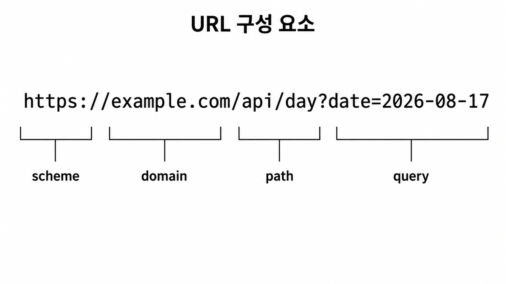

# HTTP와 API 집중하기

[← 학습 가이드 목차](./README.md) · [이전: 프론트엔드 집중하기](./02-frontend.md)

## 이 문서에서 답할 질문

> 프론트엔드와 백엔드는 어떤 정보를 어떤 형식으로 주고받는가?

앞 문서에서 체중 저장 버튼을 누르면 프론트엔드의 `saveWeight()`가 `fetchApi()`를 호출한다는 것을
살펴봤다. 이제 그 요청이 Python 백엔드로 이동하고 결과가 돌아오는 통신 구간을 확대한다.

## 먼저 기억할 한 문장

> HTTP는 요청과 응답을 주고받는 규칙이고, API는 백엔드가 제공하는 주소·동작·데이터 형식의
> 약속이다.

프론트엔드와 백엔드는 서로 다른 언어로 작성되었다. 프론트엔드는 TypeScript, 백엔드는 Python을
사용하지만 HTTP와 JSON이라는 공통 약속으로 대화할 수 있다.

## HTTP, HTTPS, API, Endpoint

### HTTP

**HTTP** (Hypertext Transfer Protocol)는 브라우저 같은 클라이언트가 서버에 요청하고 서버가
응답하는 방법을 정한 통신 규칙이다. 요청에는 어디에 무엇을 원하는지 담고, 응답에는 처리 결과를
담는다.

### HTTPS

**HTTPS** (Hypertext Transfer Protocol Secure)는 HTTP 내용을 암호화된 연결로 전달한다. 운영
사이트에서는 로그인 정보와 개인 기록이 이동하므로 HTTPS를 사용해야 한다. 암호화가 입력 검증이나
권한 확인을 대신하는 것은 아니다.

### API

**API** (Application Programming Interface)는 한 프로그램이 다른 프로그램의 기능을 사용할 수
있도록 정한 약속이다. 이 프로젝트의 Python 백엔드는 날짜별 기록 조회, 체중 저장, 로그인 같은
기능을 `/api/*` 주소로 제공한다.

### Endpoint

**Endpoint**는 API 기능 하나를 호출하는 주소와 동작이다. 예를 들어 `GET /api/day`는 하루 기록
조회 기능이고, `PUT /api/weight`는 체중 저장 기능이다.

## HTTP 요청을 여섯 부분으로 보기

체중 저장 요청을 먼저 살펴본다.

```http
PUT /api/weight
Content-Type: application/json
Cookie: diet_access_token=...

{
  "date": "2026-08-17",
  "weight": 65.4
}
```

이 짧은 요청에는 여섯 가지 정보가 들어 있다.

### 1. 목적지 URL

`/api/weight`는 요청을 받을 백엔드 기능의 경로다. 현재 사이트와 같은 도메인의 `/api/weight`로
요청하므로 브라우저는 Vercel의 Python 체중 API를 찾는다.

### 2. HTTP 메서드

`PUT`은 이 요청이 체중 기록을 저장하거나 수정하려는 동작임을 나타낸다. 같은 경로라도 메서드가
다르면 다른 동작으로 취급할 수 있다.

### 3. 헤더

**헤더** (Header)는 요청에 관한 부가 정보다. `Content-Type: application/json`은 요청 본문이 JSON
형식이라는 뜻이다. `Accept: application/json`은 프론트엔드가 JSON 응답을 기대한다는 뜻이며 공통
`fetchApi()`가 자동으로 추가한다.

### 4. 쿠키

**쿠키** (Cookie)에는 로그인 상태를 확인하는 데 필요한 정보가 담길 수 있다. 이 프로젝트의
프론트엔드와 Python API는 같은 사이트 주소를 사용한다. `fetchApi()`는
`credentials: "same-origin"`을 설정하고, 브라우저는 해당 사이트의 로그인 쿠키가 있으면 요청에
자동으로 포함한다.

프론트엔드 JavaScript가 `diet_access_token` 값을 직접 읽어 문자열로 붙이는 방식이 아니다.

### 5. 요청 본문

빈 줄 아래의 내용은 **본문** (Body)이다. 체중 저장에 필요한 날짜와 체중을 담는다. 조회 요청처럼
본문이 필요 없는 요청도 있다.

### 6. JSON

**JSON**은 이름과 값을 짝지어 데이터를 표현하는 텍스트 형식이다. JSON은 요청 본문과 응답 본문의
데이터 형식 중 하나이며, HTTP 통신 규칙 전체를 뜻하지 않는다.

## URL을 나누어 보기

예시 URL을 구성 요소별로 나누면 다음과 같다.



`example.com`은 구조 설명을 위한 예시이며 이 프로젝트의 실제 도메인이 아니다.

- `https`: 통신 방식인 scheme
- `example.com`: 사이트를 찾는 domain
- `/api/day`: 하루 기록 조회 기능의 path
- `date=2026-08-17`: 조회 조건을 전달하는 query string

쿼리 문자열은 주소에 그대로 보이고 브라우저 기록이나 로그에 남을 수 있다. 비밀번호, 로그인 토큰,
`service_role` 키 같은 비밀값을 쿼리 문자열에 넣으면 안 된다.

## HTTP 메서드와 이 프로젝트의 사용 사례

| 메서드 | 의미 | 프로젝트 예 |
| --- | --- | --- |
| GET | 데이터 조회 | `/api/day`, `/api/calendar`, 세션 확인 |
| POST | 동작 실행 또는 여러 데이터 처리 | 로그인·회원가입, `/api/import_data` |
| PUT | 한 기록 저장 또는 수정 | `/api/weight`, `/api/meal` |
| DELETE | 기록 삭제 | `/api/day`, `/api/meal` |

메서드는 요청의 의도를 표현한다. `PUT`이나 `DELETE`라는 이름만으로 안전하거나 권한이 보장되는 것은
아니다. Python 백엔드가 요청마다 로그인 회원과 입력값을 따로 검사해야 한다.

## HTTP 응답을 세 부분으로 보기

백엔드는 요청을 처리한 뒤 응답을 보낸다.

1. **상태 코드**: 요청이 성공했는지, 어떤 종류의 실패인지 나타낸다.
2. **응답 헤더**: 본문 형식이나 캐시 여부 같은 부가 정보를 전달한다.
3. **응답 본문**: 실제 데이터 또는 오류 정보를 담는다.

이 프로젝트의 JSON API는 응답 헤더에 `Content-Type: application/json`을 사용하고, 개인 기록과 인증
결과를 캐시에 남기지 않도록 `Cache-Control: no-store`를 사용한다.

## 프로젝트에서 자주 보는 상태 코드

**HTTP 상태 코드** (HTTP Status Code)는 서버가 요청을 처리한 결과의 큰 종류를 세 자리 숫자로
알려주는 값이다. 첫 숫자를 기준으로 2xx는 성공, 4xx는 요청·인증 문제, 5xx는 서버 처리 문제를
뜻한다. 표에서 숫자 옆의 영어는 각 상태 코드의 표준 이름이다.

| 상태 코드 | 의미 | 프로젝트 사례 |
| --- | --- | --- |
| `200 OK` | 요청 성공 | 조회·저장·로그아웃 성공 |
| `201 Created` | 새 대상 생성 성공 | 이메일 인증 후 회원 생성 |
| `202 Accepted` | 요청을 접수함 | 가입·인증 메일 요청 접수 |
| `400 Bad Request` | 요청 값이나 형식이 잘못됨 | 날짜·JSON·입력값 검증 실패 |
| `401 Unauthorized` | 인증에 실패했거나 로그인이 필요함 | 세션 없음, 잘못된 로그인 정보 |
| `404 Not Found` | 요청한 기능을 찾지 못함 | 존재하지 않는 API 경로 또는 인증 동작 |
| `409 Conflict` | 현재 상태와 충돌함 | 이미 존재하거나 예약된 회원가입 상태 |
| `429 Too Many Requests` | 너무 많은 요청 | 인증 메일 재전송 제한 |
| `500 Internal Server Error` | 서버 내부 처리 실패 | 서버 설정·Supabase 연동 등의 예상하지 못한 오류 |

상태 코드는 실패의 큰 종류를 알려준다. 프론트엔드는 상태 코드와 함께 응답 본문의 앱 오류 코드와
메시지를 읽어 실제 화면 동작을 결정한다.

## 프로젝트의 공통 JSON 응답

이 프로젝트의 프론트엔드와 Python 백엔드는 주요 JSON API 응답을 `{ data, error }` 형태로
주고받기로 정했다. 모든 API가 이 구조를 사용하는 것은 아니다. 이처럼 프론트엔드와 백엔드가 함께
지키기로 정한 데이터 형식을 **API 계약**이라고 한다.

### 성공 응답

```json
{
  "data": {
    "date": "2026-08-17",
    "weight": 65.4
  },
  "error": null
}
```

성공하면 실제 결과는 `data`에 들어가고 `error`는 `null`이다.

### 실패 응답

```json
{
  "data": null,
  "error": {
    "code": "VALIDATION_ERROR",
    "message": "입력값을 확인한 뒤 다시 시도해 주세요."
  }
}
```

실패하면 `data`는 `null`이고 `error`에 프로그램이 구분할 코드와 사용자에게 보여줄 메시지가
들어간다. 내부 예외 내용이나 비밀키는 이 응답에 포함하지 않는다.

프론트엔드의 [`src/types/api.ts`](../../src/types/api.ts)는 이 모양을 `ApiEnvelope` 타입으로
정의한다. Python 백엔드의 [`api/lib/response.py`](../../api/lib/response.py)는 같은 모양의 성공·오류
응답을 만든다.

## 날짜 조회와 체중 저장 비교

### 날짜별 기록 조회

```text
GET /api/day?date=2026-08-17
→ 로그인 쿠키 확인
→ 인증된 회원과 날짜의 기록 조회
→ DayRecord JSON 반환
```

조회 조건인 날짜는 쿼리 문자열로 보낸다. 별도의 요청 본문은 사용하지 않는다.

### 체중 저장

```text
PUT /api/weight + JSON body
→ 본문과 로그인 회원 확인
→ 체중 추가 또는 수정
→ 저장된 WeightRecord JSON 반환
```

저장할 날짜와 체중은 JSON 본문으로 보낸다. 두 요청 모두 로그인 쿠키를 사용하지만 메서드와 데이터를
전달하는 위치가 다르다.

## `fetchApi()`가 공통으로 처리하는 일

[`src/services/apiClient.ts`](../../src/services/apiClient.ts)의 `fetchApi()`는 모든 화면이 반복할 API
통신 작업을 한곳에 모은다.

```text
1. 요청 경로와 옵션을 브라우저 fetch()에 전달한다.
2. Accept: application/json을 설정한다.
3. 같은 사이트 요청에 쿠키가 포함되도록 한다.
4. 응답 본문을 JSON으로 읽는다.
5. data와 error가 있는 공통 응답인지 확인한다.
6. HTTP 실패 또는 error가 있으면 ApiClientError로 바꾼다.
7. 성공하면 호출한 컴포넌트에 data만 반환한다.
```

덕분에 기록 화면, 달력, 로그인 화면이 매번 JSON 파싱과 오류 형식 검사를 반복하지 않아도 된다.

## 실패를 두 층으로 읽기

예를 들어 로그인이 필요한 요청은 다음 두 정보를 함께 사용할 수 있다.

```text
HTTP 상태 코드: 401
앱 오류 코드: AUTH_REQUIRED
사용자 메시지: 로그인이 필요합니다.
```

- HTTP 상태 코드는 통신 수준에서 인증 관련 실패라는 큰 범주를 알려준다.
- 앱 오류 코드는 프론트엔드가 프로젝트 안에서 실패 원인을 구분하도록 돕는다.
- 사용자 메시지는 기술 내부를 노출하지 않고 다음 행동을 알려준다.

`404`도 문맥을 확인해야 한다. 일반적으로는 API 경로나 기능을 찾지 못했다는 뜻이다.

### 구체적인 예: 프론트엔드만 실행하고 체중 저장하기

개발자가 `npm run dev`로 프론트엔드만 실행하면 Python API는 함께 실행되지 않는다. 이때 사용자가
체중 `65.4kg`을 입력하고 저장 버튼을 누르면 다음 순서로 처리된다.

1. 프론트엔드가 `PUT /api/weight`로 체중 저장을 요청한다.
2. Python API가 실행 중이 아니므로 요청한 API를 찾지 못했다는 `404` 응답을 받는다.
3. 프론트엔드는 `404`를 확인하고 체중을 Supabase가 아닌 브라우저의 로컬 저장소에 저장한다.
4. 화면에는 `체중이 저장되었습니다.`라는 메시지가 표시된다.
5. 같은 브라우저에서 해당 날짜를 다시 열면 `GET /api/day`도 `404`를 받지만, 로컬 저장소에서
   `65.4kg`을 읽어 화면에 보여 준다.

이 기록은 현재 브라우저 안에만 있다. 다른 브라우저나 다른 기기에서는 볼 수 없으며, 브라우저의
사이트 데이터를 삭제하면 함께 사라질 수 있다. 코드에서는 `saveLocalWeight()`가 저장하고
`readLocalDay()`가 다시 읽는다.

이 방식은 Python API 없이 프론트엔드 화면을 개발할 수 있도록 마련한 임시 대체 경로다. 운영
환경에서는 Python API가 요청을 처리하고 Supabase에 데이터를 저장하는 것이 기준이다. 또한 모든
오류를 로컬 저장으로 대신하지 않고, 현재 구현은 API를 찾지 못한 `404`일 때만 이 대체 경로를
사용한다.

## 보안과 신뢰 경계

- 운영 통신은 HTTPS를 사용한다.
- 비밀번호, 토큰, `service_role` 키 같은 비밀값을 URL 쿼리에 넣지 않는다.
- 프론트엔드의 입력 검사는 빠른 안내를 위한 1차 검사다.
- 브라우저에서 온 요청은 바꿔 보낼 수 있으므로 백엔드가 입력과 로그인을 다시 검사한다.
- GET·PUT·DELETE 같은 메서드 이름만으로 권한이 생기지 않는다.

## 자주 생기는 오해

### API와 데이터베이스는 같은 것인가?

아니다. API는 프론트엔드가 사용할 기능과 통신 형식의 약속이다. 데이터베이스는 데이터를 보관한다.
이 프로젝트에서는 Python API가 요청을 검사한 뒤 데이터베이스를 사용한다.

### JSON이 HTTP 전체를 뜻하는가?

아니다. JSON은 요청이나 응답의 데이터를 표현하는 형식이다. HTTP에는 URL, 메서드, 헤더, 상태 코드
등도 포함된다.

### PUT을 사용하면 요청이 자동으로 안전한가?

아니다. 메서드는 의도를 표현할 뿐이다. HTTPS, 인증, 인가, 입력 검증이 함께 필요하다.

### 프론트엔드에서 검사했으면 백엔드는 검사하지 않아도 되는가?

아니다. 사용자는 프론트엔드를 거치지 않고 직접 API 요청을 만들 수도 있으므로 백엔드 검사가 반드시
필요하다.

## 관련 코드

- [`src/services/apiClient.ts`](../../src/services/apiClient.ts): 공통 API 요청과 응답 처리
- [`src/types/api.ts`](../../src/types/api.ts): 프론트엔드가 기대하는 API 데이터 모양
- [`src/app/page.tsx`](../../src/app/page.tsx): 날짜 조회와 체중·식단 저장 요청
- [`api/lib/http.py`](../../api/lib/http.py): 앱 오류 코드와 HTTP 상태 코드 연결
- [`api/lib/response.py`](../../api/lib/response.py): 공통 성공·오류 JSON 생성
- [`api/day.py`](../../api/day.py): 날짜별 기록 조회·삭제
- [`api/weight.py`](../../api/weight.py): 체중 저장
- [`api/meal.py`](../../api/meal.py): 식단 저장·삭제
- [`api/authentication.py`](../../api/authentication.py): 세션·회원가입·로그인·로그아웃

## 이해 확인

다음 질문에 자신의 말로 답해 본다.

1. HTTP와 API는 어떻게 다른가?
2. 체중 저장 요청의 URL, 메서드, 헤더, 쿠키, 본문, 데이터 형식은 각각 무엇인가?
3. `GET /api/day`와 `PUT /api/weight`는 데이터를 어디에 담아 보내는가?
4. HTTP 상태 코드와 앱 오류 코드는 어떤 차이가 있는가?
5. `fetchApi()`가 여러 화면을 대신해 공통으로 처리하는 일은 무엇인가?
6. 프론트엔드가 검사한 값을 백엔드가 다시 검사해야 하는 이유는 무엇인가?

## 다음 문서

다음 [백엔드 집중하기](./04-backend.md)에서는 요청을 받은 Python 백엔드가 입력, 로그인 회원,
비즈니스 규칙을 검사하고 응답을 만드는 내부 흐름을 살펴본다.
