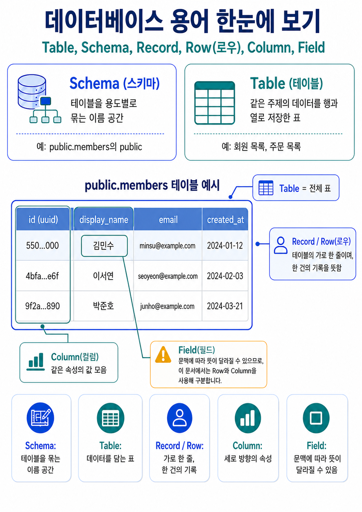
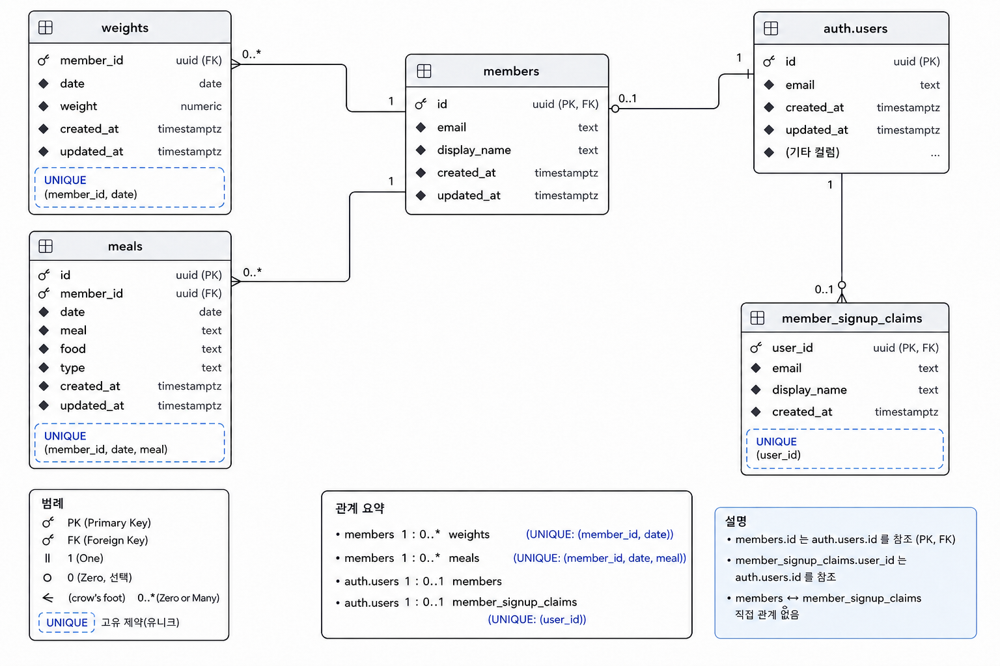

# 데이터베이스 집중하기

[← 학습 가이드 목차](./README.md) · [이전: 백엔드 집중하기](./04-backend.md)

## 이 문서에서 답할 질문

> 서버리스 함수가 끝나도 체중과 식단을 잃지 않으려면 데이터는 어디에 어떤 규칙으로 보관해야
> 하는가?

앞 문서에서는 Python 백엔드가 로그인 회원과 입력값을 확인한 뒤 Supabase에 저장을 지시하는 과정을
살펴봤다. 이제 그 데이터가 PostgreSQL 안에서 어떤 구조와 규칙으로 보관되는지 확대한다.

## 먼저 기억할 한 문장

> 데이터베이스는 데이터를 오래 보관하는 창고일 뿐 아니라, 데이터의 관계와 지켜야 할 규칙을 함께
> 관리하는 시스템이다.

Python Function의 메모리나 로컬 파일은 실행 환경이 끝나면 사라질 수 있다. 반면 데이터베이스는
서로 다른 요청과 실행 환경에서도 같은 회원의 기록을 다시 찾을 수 있도록 데이터를 영구 보관한다.

## 전체 흐름에서 데이터베이스의 위치

```text
사용자 입력
→ 프론트엔드가 HTTP 요청 전송
→ Python 백엔드가 입력과 회원 확인
→ [ Supabase PostgreSQL이 구조와 제약에 따라 저장 ]
→ Python 백엔드가 저장 결과를 응답
→ 프론트엔드가 화면 갱신
```

데이터베이스는 브라우저 화면을 만들거나 로그인 쿠키를 읽지 않는다. 백엔드가 전달한 데이터 작업을
수행하면서 테이블 관계와 제약을 마지막 경계에서 검사한다.

## Supabase와 PostgreSQL은 어떤 관계인가?

**PostgreSQL**은 데이터를 표와 관계로 관리하고 SQL로 다룰 수 있는 관계형 데이터베이스 시스템이다.
**Supabase**는 프로젝트마다 실제 PostgreSQL 데이터베이스를 제공하고 Auth, Data API, 대시보드 같은
기능을 함께 제공하는 플랫폼이다.

```text
Supabase 프로젝트
├─ PostgreSQL 데이터베이스  ← 회원 프로필·체중·식단 저장
├─ Supabase Auth             ← 로그인 사용자 관리
├─ Data API                  ← Python client의 데이터 요청 연결
└─ Dashboard                 ← 설정과 데이터를 관리하는 화면
```

따라서 “Supabase를 쓴다”와 “PostgreSQL에 저장한다”는 서로 경쟁하는 선택이 아니다. 이 프로젝트는
Supabase가 제공하는 PostgreSQL에 데이터를 저장하고, Python Supabase client로 작업을 요청한다.

## 그림과 표로 기본 용어 이해하기

먼저 `public.members` 테이블을 예로 들어 데이터베이스의 기본 용어가 각각 어느 부분을 가리키는지
살펴보자.



그림에서 **필드** (Field)는 문맥에 따라 뜻이 달라질 수 있다. 어떤 자료에서는 열을 Field라고 하고,
다른 자료에서는 행과 열이 만나는 한 칸의 값을 Field라고 한다. 이 문서에서는 혼동을 줄이기 위해
**행** (Row), **열** (Column), **값**으로 나누어 표현한다.

체중 테이블의 일부가 다음과 같다고 생각해 보자.

| member_id | date | weight | updated_at |
| --- | --- | ---: | --- |
| `user-a` | `2026-08-16` | 65.8 | `2026-08-16 09:10+00` |
| `user-a` | `2026-08-17` | 65.4 | `2026-08-17 08:50+00` |
| `user-b` | `2026-08-17` | 72.1 | `2026-08-17 10:20+00` |

- **데이터베이스** (Database): 여러 schema와 table, 규칙을 담는 전체 저장 공간이다.
- **스키마** (Schema): table을 용도별로 묶는 이름 공간이다. `public.weights`의 `public`이 schema다.
- **테이블** (Table): 같은 종류의 데이터를 표 형태로 모은다. `weights`는 체중 기록 table이다.
- **레코드·행** (Record / Row): 기록 한 건이다. 위 표의 가로 한 줄이 한 회원의 하루 체중이다.
- **열** (Column): 각 기록이 공통으로 가지는 항목이다. `date`, `weight` 등이 column이다.
- **데이터 타입** (Data Type): column에 저장할 값의 종류다. 날짜는 `date`, 체중은
  `numeric(6, 2)`를 사용한다.
- **NULL**: 값이 아직 없거나 알 수 없음을 나타낸다. 숫자 `0`이나 빈 문자열 `""`과 다르다.

SQL에서는 `public.weights`처럼 `schema.table` 형태로 정확한 대상을 표현할 수 있다.

## 이 프로젝트의 핵심 테이블 지도

현재 구조는 [`supabase/migrations/`](../../supabase/migrations)의 SQL 파일을 이름 순서대로 모두
적용한 결과다.

| 테이블 | 역할 | 주요 식별 기준 |
| --- | --- | --- |
| `auth.users` | Supabase Auth가 관리하는 로그인 사용자 원본 | `id` |
| `public.members` | 이 앱에서 사용하는 회원 프로필 | `id`, 고유한 `email` |
| `public.weights` | 회원별 날짜별 체중 | `(member_id, date)` |
| `public.meals` | 회원별 날짜·끼니별 식단 | `id`, `(member_id, date, meal)` |
| `public.member_signup_claims` | 이메일 확인 전 이름·이메일 임시 보관 | `user_id` |

### ERD로 보는 테이블의 관계

**ERD** (Entity-Relationship Diagram, 개체-관계 다이어그램)는 테이블에 어떤 열이 있고 테이블끼리
어떻게 연결되는지 한눈에 보여 주는 그림이다. 다음 ERD는 이 프로젝트의 핵심 열, 키, 관계와 UNIQUE
제약을 중심으로 단순화한 것이다. 전체 구조는 마이그레이션 파일을 기준으로 확인한다.



그림의 관계만 간단히 읽으면 다음과 같다.

```text
auth.users
    1
    │ id
    │
    0 또는 1
public.members
    1
    ├────────── 0개 이상 public.weights
    │              member_id → members.id
    └────────── 0개 이상 public.meals
                   member_id → members.id
```

가입을 완료한 회원은 `auth.users`와 `public.members`가 같은 UUID로 1대1 대응한다. 다만 이메일을
아직 확인하지 않았다면 `auth.users` 사용자는 있어도 `members` 행은 없을 수 있다. 그 사이의 이름과
이메일은 `member_signup_claims`에 잠시 보관된다.

한 회원은 체중과 식단 기록을 여러 개 가질 수 있다. 각 기록의 `member_id`가 어느 회원의 기록인지
연결한다. 회원 행의 외래 키에는 `ON DELETE CASCADE`가 설정되어 있어 회원이 삭제되면 연결된 체중,
식단과 가입 대기 정보도 함께 삭제된다.

## 제약 조건은 잘못된 상태를 막는 규칙이다

프론트엔드와 백엔드가 값을 검사해도 다른 코드나 관리 도구가 데이터베이스에 접근할 수 있다.
**제약 조건** (Constraint)은 어떤 경로로 데이터가 들어오더라도 데이터베이스가 마지막으로 지키는
규칙이다.

### PRIMARY KEY: 행 하나를 대표하는 식별자

**기본 키** (Primary Key, PK)는 table 안에서 행 하나를 유일하게 식별한다. 값이 중복될 수 없고
`NULL`일 수도 없다.

- `members.id`는 회원 행의 PK다.
- `meals.id`는 식단 행의 UUID PK이며 값이 없으면 `gen_random_uuid()`가 기본값을 만든다.
- `member_signup_claims.user_id`는 가입 대기 행의 PK다.

현재 `weights`는 처음에는 `date`가 PK였지만 다중 회원 구조로 변경하면서 그 PK를 제거했다. 지금은
별도의 PK 없이 `(member_id, date)` UNIQUE가 회원별 하루 체중 슬롯을 구분한다. 일반적으로 table마다
안정적인 PK를 두는 것이 권장되지만, 여기서는 현재 마이그레이션의 실제 상태를 기준으로 이해한다.

### FOREIGN KEY: 다른 테이블과의 관계

**외래 키** (Foreign Key, FK)는 값이 다른 table의 실제 행을 가리키도록 보장한다.

- `members.id`는 `auth.users(id)`를 가리킨다.
- `weights.member_id`와 `meals.member_id`는 `members(id)`를 가리킨다.
- `member_signup_claims.user_id`는 `auth.users(id)`를 가리킨다.

존재하지 않는 회원 ID를 외래 키 column에 저장하려 하면 데이터베이스가 거부한다.

### UNIQUE: 같은 값 조합의 중복 금지

**UNIQUE**는 지정한 값 또는 값의 조합이 중복되지 않도록 한다.

```text
weights UNIQUE (member_id, date)
→ 같은 회원은 같은 날짜에 체중 행을 하나만 가짐

meals UNIQUE (member_id, date, meal)
→ 같은 회원은 같은 날짜의 같은 끼니에 식단 행을 하나만 가짐
```

예를 들어 `user-a`와 `user-b`는 같은 날짜에 각각 체중을 저장할 수 있다. 그러나 `user-a`가 같은
날짜에 체중 행 두 개를 만들 수는 없다. 여러 column을 묶어 유일성을 검사하므로 **복합 UNIQUE**라고
부른다.

PK도 중복을 막지만 table을 대표하는 식별자는 하나뿐이다. UNIQUE는 업무상 중복되면 안 되는 다른
값 조합에도 여러 개 둘 수 있다는 차이가 있다.

### NOT NULL: 반드시 값이 있어야 함

**NOT NULL**은 해당 column에 `NULL`을 저장하지 못하게 한다. `members.email`, `weights.weight`,
`meals.date`, `meals.food` 같은 필수 값에 사용한다.

현재 마이그레이션에서 `weights.member_id`와 `meals.member_id`에는 `NOT NULL`이 명시되어 있지 않다.
과거 단일 사용자 데이터를 회원에게 연결하는 전환 과정에서 추가된 column이기 때문이다. 현재
Python API는 인증된 회원 ID를 새 기록에 항상 넣고 개인 기록 query에도 같은 ID 조건을 사용한다.

이 차이는 “API가 현재 값을 넣는다”와 “데이터베이스가 NULL을 절대 거부한다”가 같은 보장이 아님을
보여준다. 또한 PostgreSQL의 UNIQUE는 일반적으로 `NULL`끼리를 같은 값으로 보지 않으므로,
`member_id`가 NULL인 행에는 회원별 UNIQUE의 의도가 그대로 적용되지 않는다.

### CHECK: 값이 조건을 만족해야 함

**CHECK**는 값이 정해진 조건을 만족하는지 검사한다.

- `weights.weight > 0`: 체중은 양수여야 한다.
- `meals.meal`: `breakfast`, `lunch`, `dinner`, `snack` 중 하나여야 한다.
- `meals.type`: `clean`, `free` 중 하나여야 한다.
- `members.display_name`: 길이가 1자 이상 50자 이하여야 한다.

### DEFAULT: 생략했을 때 사용할 값

**DEFAULT**는 INSERT할 때 값을 생략하면 데이터베이스가 넣을 기본값이다. `created_at`과
`updated_at`은 처음 저장할 때 `now()`를 사용하고, `meals.id`는 임의 UUID를 만든다.

## 같은 값을 여러 계층에서 검사하는 이유

| 계층 | 목적 | 체중 저장 예 |
| --- | --- | --- |
| 프론트엔드 | 사용자가 빠르게 고칠 수 있도록 안내 | 입력 여부와 숫자 형식 안내 |
| Python·Pydantic | 신뢰할 수 없는 HTTP 요청 거부 | 양수, 9999.99 이하, 유한한 수, 미래 날짜 금지 |
| PostgreSQL 제약 | 저장소의 최종 일관성 보호 | `weight > 0`, NOT NULL, 회원·날짜 UNIQUE, FK |

세 계층의 규칙은 일부 겹치지만 완전히 같지는 않다. 예를 들어 체중 상한과 미래 날짜 금지는 현재
Python 모델이 확인하고, 데이터베이스에는 같은 CHECK가 없다. 반대로 FK와 UNIQUE는 데이터베이스가
여러 요청 사이에서도 최종적으로 보장한다. 한 계층이 있다고 다른 계층을 생략할 수는 없다.

## CRUD로 데이터 작업 읽기

데이터의 대표적인 네 작업을 **CRUD**라고 부른다.

| CRUD | 의미 | 이 프로젝트의 예 |
| --- | --- | --- |
| Create | 새 행 추가 | 처음 체중·식단 저장 |
| Read | 행 조회 | 하루 기록, 한 달 달력 조회 |
| Update | 기존 행 수정 | 같은 날짜의 체중, 같은 끼니의 식단 다시 저장 |
| Delete | 행 삭제 | 하루 전체 또는 날짜의 식단 삭제 |

이 프로젝트는 Python에서 SQL 문자열을 직접 조립하기보다 Supabase client의 메서드로 의도를 표현한다.

```python
(
    client.table("weights")
    .select("date,weight")
    .eq("member_id", member.id)
    .eq("date", requested_date)
    .execute()
)
```

코드의 의미는 “`weights`에서 이 회원과 날짜가 같은 행의 날짜·체중을 조회하고 실행한다”다.

- `.table()`은 대상 table을 고른다.
- `.select()`는 읽을 column을 고른다.
- `.eq()`는 값이 같은 행만 남긴다.
- `.gte()`와 `.lte()`는 달력 조회에서 날짜의 시작·끝 범위를 정한다.
- `.upsert()`는 새로 추가하거나 충돌한 행을 갱신한다.
- `.delete()`는 조건에 맞는 행을 삭제한다.
- `.execute()`는 지금까지 조립한 요청을 실제로 실행한다.

여기서는 SQL 문법 전체를 외우기보다 코드가 **어느 table에서 어떤 조건으로 어떤 작업을 하는지**
읽을 수 있으면 충분하다.

## 체중 upsert는 INSERT와 UPDATE를 합친 동작이다

[`upsert_weight()`](../../api/weight.py)는 다음 충돌 기준을 사용한다.

```python
.upsert(payload, on_conflict="member_id,date")
```

**upsert**는 대상 슬롯의 존재 여부에 따라 두 갈래로 동작한다.

```text
(member_id, date)가 같은 행이 없는가?
├─ 예   → INSERT: 새 체중 행 추가
└─ 아니오 → UPDATE: 기존 체중 행의 값 갱신
```

`on_conflict="member_id,date"`가 동작하려면 데이터베이스에도 같은 column 조합의 UNIQUE 제약이
있어야 한다. API 코드의 문자열과 마이그레이션의 `weights_member_date_unique`가 서로 맞물린다.

애플리케이션이 “먼저 조회하고, 없으면 추가”를 서로 다른 요청으로 처리하면 두 실행이 동시에 같은
결론을 내릴 수 있다. UNIQUE 제약과 한 번의 upsert로 결정을 데이터베이스에 맡기면 인증된 회원
기록에서 중복 행 생성을 막는 데 유리하다. 식단은 `(member_id, date, meal)`을 같은 방식으로 사용한다.

## 인덱스는 행을 찾는 색인이다

**인덱스** (Index)는 책 뒤의 색인처럼 모든 행을 처음부터 확인하지 않고 조건에 맞는 위치를 찾도록
도울 수 있는 별도 구조다.

현재 마이그레이션에는 다음 명시적 인덱스가 있다.

- `meals_member_date_index (member_id, date)`
- `weights_member_date_index (member_id, date)`
- `meals_date_index (date)`

[`GET /api/day`](../../api/day.py)는 회원과 하루 날짜를 조건으로 검색한다. 달력 API는 회원과 월의
시작·끝 날짜 범위를 조건으로 체중과 식단을 찾는다. `(member_id, date)` 순서의 인덱스는 이런 검색을
도울 수 있다.

PostgreSQL은 PK와 UNIQUE를 만들 때 이를 검사할 고유 인덱스도 자동으로 만든다. 이 프로젝트에는
`(member_id, date)` UNIQUE와 같은 column의 일반 인덱스가 함께 존재하는 경우가 있다. 인덱스를
추가한다고 항상 더 빨라지는 것은 아니며, 저장·수정·삭제 때 인덱스도 갱신해야 하고 디스크 공간도
필요하다. 실제 query 계획과 사용량을 측정한 뒤 유지 여부를 판단해야 한다.

## 마이그레이션은 데이터베이스의 변경 이력이다

**마이그레이션** (Migration)은 데이터베이스 구조와 규칙을 버전별 SQL 파일로 기록하는 방식이다.
이 프로젝트는 파일명 앞의 숫자가 작은 것부터 차례대로 적용한다.

```text
202608120001  weights 생성: 날짜가 PK인 단일 사용자 구조
→ 202608120002~010  meals column·제약·인덱스 추가
→ 202608120011  RLS와 DB 역할 권한 설정
→ 202608130001  members 및 member_id 추가, 회원별 UNIQUE로 변경
→ 202608130002  이메일 확인 전 가입 대기 구조 추가
→ 202608130003  단일 회원 제한 제거, 다중 회원 가입으로 변경
```

마지막 파일만 읽으면 앞에서 만들어진 table과 column이 보이지 않고, 첫 파일만 읽으면 현재 다중 회원
구조를 놓친다. **최종 스키마는 모든 마이그레이션을 순서대로 적용한 결과**다.

이미 운영 환경에 적용한 과거 마이그레이션을 고치면 새 환경과 기존 환경의 변경 이력이 달라질 수
있다. 다음 구조 변경은 보통 새로운 번호의 마이그레이션 파일로 기록한다.

### 트랜잭션: 여러 변경을 한 작업으로 묶기

일부 마이그레이션은 `BEGIN`으로 시작하고 `COMMIT`으로 끝난다. **트랜잭션** (Transaction)은 그 사이의
여러 작업을 하나의 단위로 묶는다. 모두 성공하면 반영하고 중간에 실패하면 일부만 적용된 어정쩡한
상태를 피할 수 있다.

`member_id` 추가, UNIQUE 변경, 권한 설정처럼 서로 의존하는 여러 변경을 한 구조 변경으로 처리할 때
이 경계가 중요하다.

## 누가 데이터베이스에 접근하는가?

현재 `members`, `weights`, `meals`, `member_signup_claims`에는 RLS(Row Level Security)가 켜져 있다.
브라우저용 `anon`, `authenticated` 역할의 table 권한은 회수되어 브라우저가 이 table들을 직접
다루지 않는다.

```text
브라우저
  └─ HTTP → Python API
                 └─ service role → Supabase PostgreSQL
```

서버의 service role은 RLS를 우회할 수 있으므로, Python API가 로그인 회원을 확인하고 모든 개인 기록
query에 올바른 `member_id`를 넣어야 한다. RLS, service role, 인증과 인가의 차이는 다음 인증
문서에서 한 개념씩 자세히 살펴본다.

## SQL 용어는 나중에 묶어서 이해하기

지금까지 본 SQL은 목적에 따라 다음처럼 묶을 수 있다.

- **DDL** (Data Definition Language): `CREATE TABLE`, `ALTER TABLE`, `CREATE INDEX`처럼 구조를 바꾼다.
- **DML** (Data Manipulation Language): `SELECT`, `INSERT`, `UPDATE`, `DELETE`처럼 데이터를 다룬다.

권한을 다루는 DCL, 트랜잭션을 다루는 TCL이라는 분류도 있다. PostgreSQL과 다른 저장 방식인 NoSQL도
있지만, 현재 프로젝트 코드를 읽는 데는 table·관계·제약·CRUD를 먼저 이해하는 것이 중요하다.

## 파일을 어디서부터 읽으면 될까?

1. [`supabase/migrations/`](../../supabase/migrations)의 파일명을 작은 번호부터 훑는다.
2. [`202608120001_create_weights.sql`](../../supabase/migrations/202608120001_create_weights.sql)에서
   초기 체중 구조를 본다.
3. [`202608130001_add_single_member_auth.sql`](../../supabase/migrations/202608130001_add_single_member_auth.sql)에서
   회원 관계와 복합 UNIQUE 변경을 본다.
4. [`202608130003_enable_multi_member_signup.sql`](../../supabase/migrations/202608130003_enable_multi_member_signup.sql)에서
   현재 다중 회원 가입 구조를 확인한다.
5. [`api/weight.py`](../../api/weight.py)와 [`api/meal.py`](../../api/meal.py)의 `on_conflict`가 UNIQUE
   제약과 일치하는지 대조한다.
6. [`api/day.py`](../../api/day.py)와 [`api/calendar.py`](../../api/calendar.py)의 조회 조건에서
   `member_id`와 날짜가 어떻게 사용되는지 확인한다.

마이그레이션은 구조의 이력이고 Python endpoint는 그 구조를 사용하는 코드다. 둘을 함께 읽어야
현재 동작을 정확히 이해할 수 있다.

## 자주 생기는 오해

### Supabase와 PostgreSQL은 같은 뜻인가?

아니다. PostgreSQL은 관계형 데이터베이스 시스템이고, Supabase는 PostgreSQL과 Auth·API·관리 도구를
함께 제공하는 플랫폼이다.

### 데이터베이스 제약이 있으면 API 검증은 생략해도 되는가?

아니다. API는 사용자에게 이해 가능한 오류를 빠르게 돌려주고 업무 규칙을 검사한다. DB 제약은 어떤
경로로 들어오더라도 저장소가 잘못된 상태가 되지 않도록 마지막으로 보호한다.

### UNIQUE와 PK는 같은 것인가?

둘 다 중복을 막는 성질이 있지만 역할이 다르다. PK는 table의 행을 대표하는 식별자이고 NULL을
허용하지 않으며 table마다 하나다. UNIQUE는 다른 업무상 중복 금지 규칙에도 여러 개 둘 수 있다.

### NULL은 0이나 빈 문자열인가?

아니다. NULL은 값이 없거나 알려지지 않았다는 별도 상태다. `0`과 `""`은 각각 실제 숫자와 문자열
값이다.

### upsert는 항상 새 행을 만드는가?

아니다. 충돌 기준에 맞는 행이 없으면 추가하고, 이미 있으면 그 행을 갱신한다.

### 인덱스가 많을수록 모든 query가 빨라지는가?

아니다. 조건과 column 순서에 따라 쓰이지 않을 수 있고, 쓰기 비용과 저장 공간도 늘어난다. 실제
query를 측정해 판단해야 한다.

### 마이그레이션 하나에 현재 구조가 모두 적혀 있는가?

아니다. 각 파일은 한 시점의 변경만 기록한다. 현재 구조는 모든 파일을 순서대로 적용한 결과다.

## 이해 확인

1. `auth.users`, `members`, `weights`, `meals`는 어떤 관계인가?
2. 체중의 `(member_id, date)` UNIQUE는 어떤 중복을 막는가?
3. `weights.member_id`의 FK는 어떤 잘못된 값을 막는가?
4. 같은 회원과 날짜의 체중을 두 번 저장하면 upsert는 어떻게 동작하는가?
5. 첫 번째 마이그레이션만 읽고 현재 스키마라고 판단하면 무엇을 놓치는가?
6. 프론트엔드 검증, Pydantic 검증, PostgreSQL 제약은 각각 어떤 목적을 가지는가?

답하기 어렵다면 **핵심 테이블 지도 → 제약 조건 → 체중 upsert** 순서로 다시 읽는다.

## 공식 참고 자료

- [Supabase Database](https://supabase.com/docs/guides/database/overview)
- [Supabase Python: Upsert data](https://supabase.com/docs/reference/python/upsert)
- [PostgreSQL: Constraints](https://www.postgresql.org/docs/current/ddl-constraints.html)
- [PostgreSQL: Introduction to Indexes](https://www.postgresql.org/docs/current/indexes-intro.html)

## 다음 문서

다음 [인증과 인가 집중하기](./06-authentication.md)에서는 사용자 식별이 왜 필요한지에서 시작해
인증·인가, 세션, 쿠키, 토큰, JWT를 하나씩 쌓은 뒤 Supabase Auth와 현재 로그인 흐름을 다시
조립한다.
